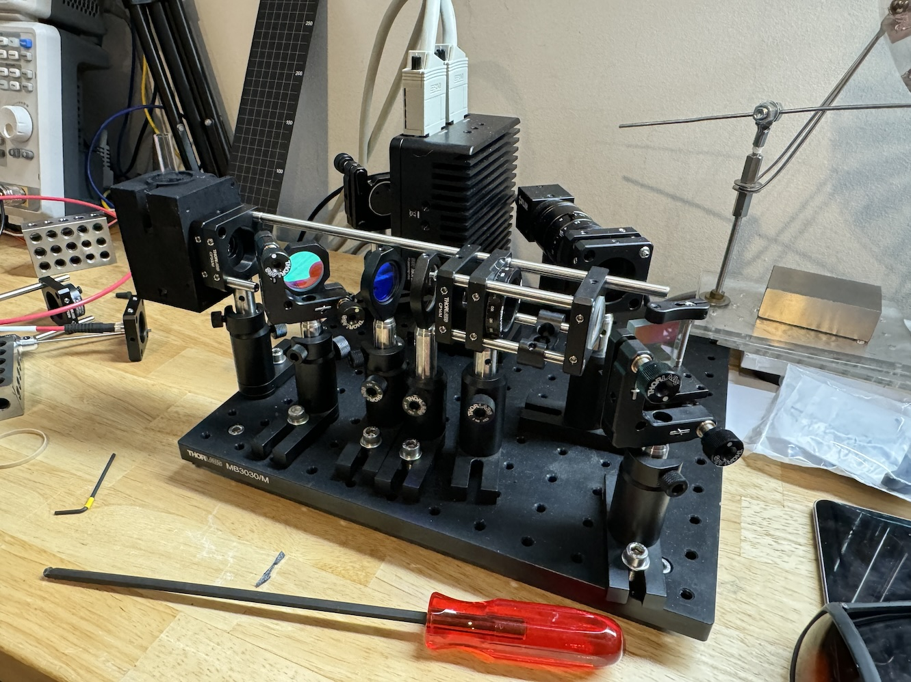
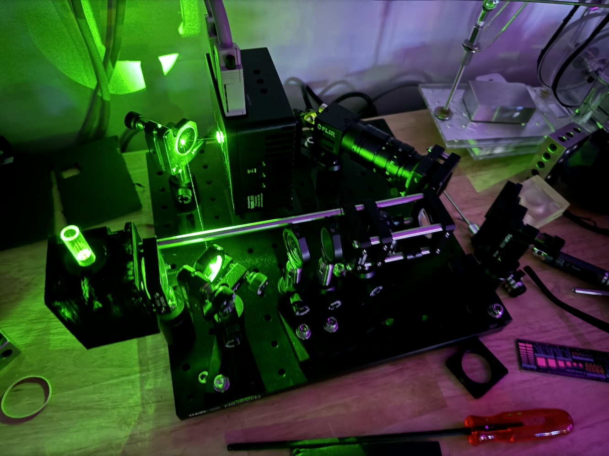
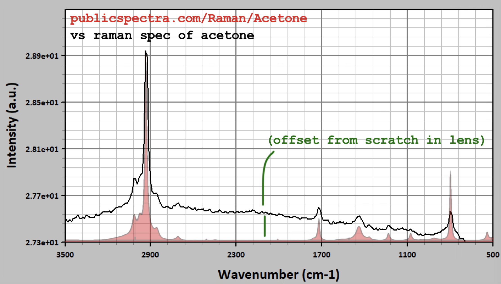

# OpenRAMAN

This is a clone of various components of the excellent [OpenRAMAN](https://www.open-raman.org/) project.

I am not the author of the project but wanted a way to track and contribute updates (and the project does not already have a git repo that I'm aware of). The author, Luc, also has a great scientific portfolio, [The Pulsar](https://www.thepulsar.be), a [forum](https://talk.thepulsar.be/), and a [Patreon](https://www.patreon.com/thepulsar/).

## Directories

- [software](software) - contains the spectrum analyzer suite, originally [r105](https://www.thepulsar.be/files/Spectrum%20Analyzer%20Suite%20r105.zip) and updated to [r123 (v1.0.1)](https://www.thepulsar.be/files/Spectrum%20Analyzer%20Suite%20r123.zip)
  - note you'll need the FLIR Spinnaker SDK v2.0.0.147 ([32-bit version](https://www.thepulsar.be/files/SpinnakerSDK_FULL_2.0.0.147_x86.exe) or [64-bit version](https://www.thepulsar.be/files/SpinnakerSDK_FULL_2.0.0.147_x64.exe)) per the original site's [software page](https://www.open-raman.org/build/software/)

- spectrometers - note you will also need the bill of materials and a build of both a spectrometer and cuvette
  - [performance](performance) - STEP files, PDF with assembly, and bill of materials for [rev2](https://www.thepulsar.be/files/performance%20edition%20rev2.zip) of the [performance edition](https://www.open-raman.org/build/performance-edition/) of the spectrometer
- [cuvettes](cuvettes) - STEP files, PDFs with assembly, and bill of materials
  - [liquid (standard) cuvette](cuvettes/liquid) - from [rev1 zip](https://www.thepulsar.be/files/standard-cuvette-rev1.zip) from [standard cuvette page](https://www.open-raman.org/build/cuvettes/standard-cuvette/)
  - [solid cuvette](cuvettes/solid) - from [rev0 zip](https://www.thepulsar.be/files/solid%20cuvette%20rev0.zip) from [solid cuvette page](https://www.open-raman.org/build/cuvettes/solid-cuvette/)

- [images](images) - my own build based off the performance optical components in breadboard form factor

### License

Per OpenRAMAN's [legal](https://www.open-raman.org/about/legal/) page, this project is licensed under [CERN-OHL-W-v2](https://www.open-raman.org/cern_ohl_w_v2.pdf).
